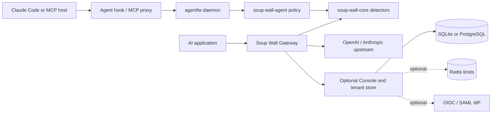

# Soup Wall architecture

Soup Wall has two enforcement paths and one optional self-hosted control plane. The paths share detection and policy code, but they do not require a Soup Wall service or account.

## Source map

| Directory | Responsibility |
| --- | --- |
| `crates/core` | Detection, normalization, findings, scoring, text policy and masking |
| `crates/agent` | Agent events, taint, action class, egress, authority and decision policy |
| `crates/agentfw` | Local daemon, Claude Code hooks, MCP proxy, grants, audit and guarded execution |
| `crates/proxy` | HTTP data plane for Chat Completions, Responses and Messages, plus the self-hosted Console and tenant store |
| `crates/adapter` | Versioned local decision and audit types for future integrations |
| `crates/bench` | Reproducible regression corpora and policy gates |
| `policies` | Built-in text policy; the agent default is under `crates/agent/policies` |
| `deploy` | Container, Compose, Kubernetes and edge examples |

The Gateway and Console currently live in one `crates/proxy` package. A local Gateway can run without a tenant store; enabling `tenant_store` adds the Console, tenant authentication and optional identity services. This is a configuration boundary today. Splitting the package for a smaller local install is a future refactor, not a prerequisite for accessing any source.

## Decision boundaries

The Agent computes verdicts for tool actions and records them locally. Its default is shadow mode. The Claude Code hook depends on host behavior and fails open when the daemon is unavailable. The guarded execution commands own process creation and fail closed. See [SECURITY.md](../SECURITY.md) before treating a hook verdict as an execution boundary.

The legacy MCP proxy checks manifests. Opt-in [stdio MCP admission](operations/MCP_STDIO_ADMISSION.md)
uses the reviewed native registry to gate supported calls before server execution
and original text results before release to the MCP host. It fails closed and
supports a bounded sequential contract; host release is not attestation of
the host's later model-context serialization.

The Gateway inspects request and response traffic and applies its text policy. Agent inspection and capability policy in the Gateway are separate opt-in controls. A provider request deliberately leaves the host for the configured upstream. With the Console enabled, audit and usage data can also be written to the configured local or external store.

The Console does not currently distribute Agent policy automatically. `soup-wall-adapter` defines a versioned contract for that integration, and the [roadmap](ROADMAP.md) tracks the work. Keep Agent and Gateway policies explicit until a tested rollout path exists.

## Where to work next

Add a detector in `crates/core`, an agent decision rule in `crates/agent`, or a provider adapter in `crates/proxy`. For every enforcement change, add a test for the unsafe action and a benign case that should still succeed. Run the [full workspace checks](../CONTRIBUTING.md) and the relevant policy regression corpus before changing a default.
